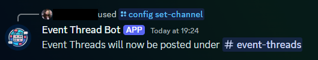
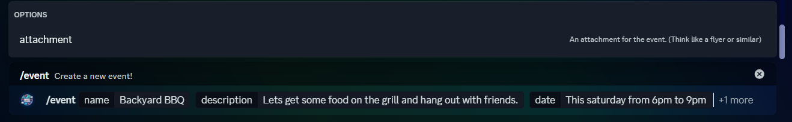
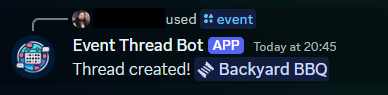
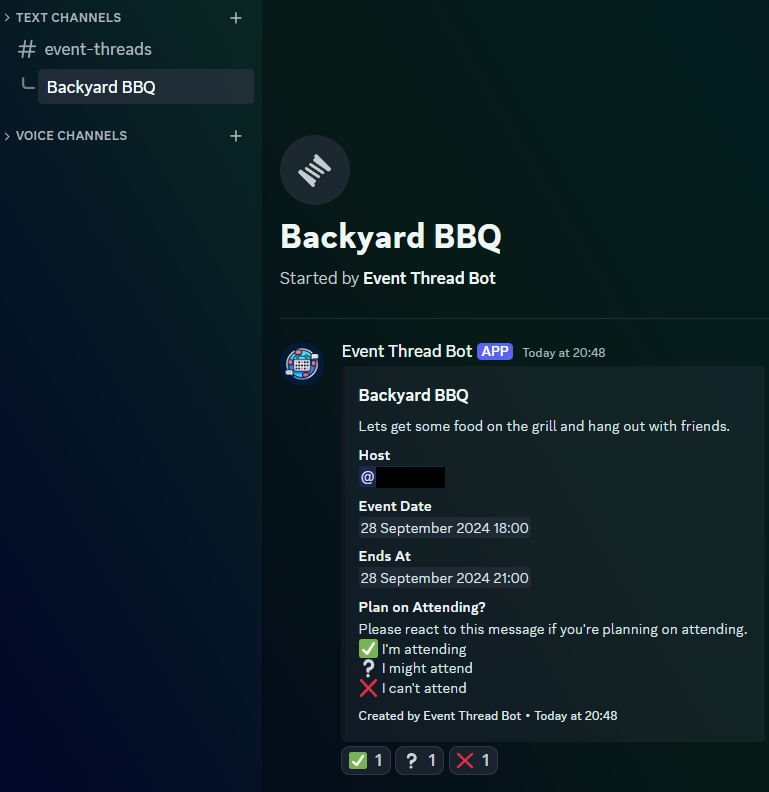

# Discord Event Thread Bot

[](https://github.com/iamdavidfrancis/discord-event-thread-bot/actions/workflows/publish-docker.yml)

Allows users to create threads for their events easily. Still very much a Proof of Concept.

**Note:** This doesn't use the "Events" feature in Discord. This simply makes threads in a channel and posts and embed with event details.

This is mostly a learning exercise because I was bored. Don't expect great things here.

## Usage

### Hosting the bot

If you want to self-host the bot, you'll need:

1. A discord bot registration
2. Somewhere to host the docker container
3. An Azure Storage Account with a Table
4. A way to access the table store.

I host the bot in Azure with an Azure Container App, so I'm using a Managed Identity. When I debug locally, I use a Service Principal registered in the directory.

For information about deploying with azure, see the [./infrastructure](./infrastructure) folder.

#### Running Locally

If you're running locally, you'll want to create a `.env` file for the environment variables. You'll need to set:

```dotenv
DISCORD_TOKEN={Token from Discord App}
DISCORD_CLIENT_ID={Client ID from Discord App}
AZURE_TENANT_ID={The Directory ID where the Azure Storage Account is located}
AZURE_CLIENT_ID={The SP Client ID}
AZURE_CLIENT_SECRET={The SP Secret}
STORAGE_ACCOUNT_NAME={The storage account name}
STORAGE_TABLE_NAME={The storage table name}
```

Once the `.env` file is created, you can run:

```sh
docker pull ghcr.io/iamdavidfrancis/discord-event-thread-bot:latest
docker run --name "discord-event-thread-bot" --env-file ./.env ghcr.io/iamdavidfrancis/discord-event-thread-bot:latest
```

#### Running in Azure

If you're running in Azure with a managed identity you'll need to set everything in the above section, except the `Azure_` environment variables.

#### Verify its running

If everything worked, you should see this console log line:

```
Discord bot is ready!
```

### Configuration

Once the bot is installed, you should configure the channel it will create threads under via the `/config set-channel` command. The bot will respond if this succeeds:



### Creating Events

Once the bot is configured, you can use the `/event` command to create a new event. The command has several options that can be set:

| Option        | Required? | Description                                                                                                                                                                                                                |
| ------------- | --------- | -------------------------------------------------------------------------------------------------------------------------------------------------------------------------------------------------------------------------- |
| `name`        | Yes       | The name of the event.                                                                                                                                                                                                     |
| `description` | No        | More detail about the event. If this is omitted, the bot will construct a description from the other information provided.                                                                                                 |
| `date`        | No        | The date of the event. Can use a date string like `2024-09-30T18:00:00Z` or natural language like `This saturday from 6pm to 9pm PST`. Note: The default timezone is UTC, but it will honor a timezone if you include one. |
| `attachment`  | No        | This can be a flyer or some other image associated with the event. It will be added to the embed in the thread.                                                                                                            |

Here's an example of the command:



Once the command is run you will see a reply in the channel you sent the message from, and the thread will be created. Here's an example command:

```
/event name:Backyard BBQ date:This saturday from 6pm to 9pm PDT description:Lets get some food on the grill and hang out with friends.
```

The response from the bot:



Clicking on the link will take you to the thread:


